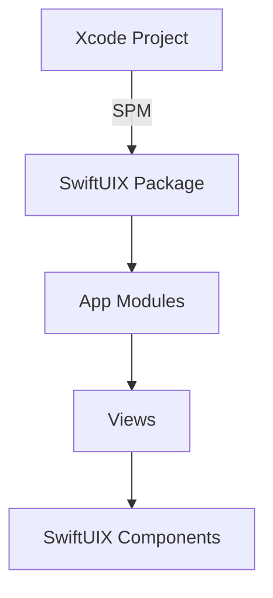

# Ticket: SwiftUIX-01 — Add SwiftUIX Dependency and Basic Integration

Read /Users/sasha/IdeaProjects/ios/zariz/dev/tickets/coding_rules.md first

## 1. Task Summary

**Objective:** Integrate SwiftUIX library into the Zariz iOS project to enhance UI capabilities.

**Expected Outcome:** SwiftUIX is added as a Swift Package dependency, builds successfully, and basic components are accessible throughout the app.

**Success Criteria:**
- SwiftUIX package added via SPM
- Project builds without errors
- Basic SwiftUIX import works in at least one view
- No breaking changes to existing functionality

**Go/No-Go Preconditions:**
- Xcode 15+ installed
- Project builds successfully before changes
- Git working tree is clean

## 2. Assumptions & Scope

**Assumptions:**
- SwiftUIX is compatible with iOS 17+ target
- Library is actively maintained and stable
- No conflicts with existing dependencies

**In Scope:**
- Add SwiftUIX via SPM
- Verify build and import
- Document integration in README

**Out of Scope:**
- Implementing specific SwiftUIX components (covered in subsequent tickets)
- Refactoring existing UI code
- Performance optimization

**Non-Goals:**
- Replacing all existing SwiftUI components immediately
- Adding other UI libraries

## 3. Architecture Overview

**Components:**
- **Package.swift / Xcode Project:** Add SwiftUIX dependency
- **App Entry Point:** Verify import capability
- **Build System:** Ensure clean compilation

**Pattern:** Dependency injection via SPM; no architectural changes required.

**Diagram:**


**MVP Deployability:** No impact on deployment; library is client-side only.

## 4. Affected Modules/Files

**Files to Modify:**
- `ios/Zariz.xcodeproj/project.pbxproj`: Add package dependency (via Xcode UI or manual edit)
- `ios/Zariz/ZarizApp.swift`: Add test import to verify integration

**Files to Create:**
- None (dependency only)

**Config Files:**
- None

## 5. Implementation Steps

1. **Open Xcode Project**
   - Navigate to `ios/Zariz.xcodeproj`
   - Open in Xcode 15+

2. **Add SwiftUIX Package**
   - File → Add Package Dependencies
   - Enter URL: `https://github.com/SwiftUIX/SwiftUIX`
   - Select version: Up to Next Major (latest stable)
   - Add to target: Zariz

3. **Verify Import**
   ```swift
   // In ZarizApp.swift or any view file
   import SwiftUIX
   
   // Test basic component availability
   struct TestView: View {
       var body: some View {
           Text("SwiftUIX Ready")
               .padding()
       }
   }
   ```

4. **Build Project**
   - Cmd+B to build
   - Resolve any dependency conflicts
   - Ensure zero errors

5. **Commit Changes**
   ```bash
   git add ios/Zariz.xcodeproj
   git commit -m "Add SwiftUIX dependency via SPM"
   ```

## 6. Interfaces & Contracts

**Package Dependency:**
- Repository: `https://github.com/SwiftUIX/SwiftUIX`
- Version: Latest stable (e.g., 0.1.9+)
- Platform: iOS 17+

**Import Contract:**
```swift
import SwiftUIX
// All SwiftUIX components now available
```

**Backward Compatibility:** No breaking changes; additive only.

## 7. Data Model & Migration

Not applicable (UI library only).

## 8. Testing & Validation

**Unit Tests:**
- Verify project builds: `xcodebuild -scheme Zariz -destination 'platform=iOS Simulator,name=iPhone 15' build`

**Integration Tests:**
- Import SwiftUIX in test file
- Instantiate basic component (e.g., `CocoaTextField()`)

**Adversarial:**
- Build with different Xcode versions (15.0, 15.4)
- Test on iOS 17.0 and 18.0 simulators

**Test Files:**
- `ios/ZarizTests/SwiftUIXIntegrationTests.swift`:
  ```swift
  import XCTest
  import SwiftUIX
  @testable import Zariz
  
  final class SwiftUIXIntegrationTests: XCTestCase {
      func testSwiftUIXImport() {
          // Verify library is accessible
          XCTAssertNotNil(CocoaTextField.self)
      }
  }
  ```

## 9. Observability & Operations

**Logging:**
- OSLog entry on app launch: `log.info("SwiftUIX integrated: version=\(SwiftUIX.version)")`

**Metrics:**
- Build time impact (should be < 10s increase)
- Binary size increase (monitor .ipa size)

**Feature Flags:** None required.

**Rollout Plan:** Single commit; no gradual rollout needed.

## 10. Risks & Considerations

| Risk | Impact | Mitigation |
|------|--------|------------|
| Build time increase | Low | Monitor CI build times |
| Binary size bloat | Medium | Measure .ipa size before/after |
| Version conflicts | Low | Use SPM version resolution |
| Unmaintained library | Medium | Check GitHub activity; have fallback plan |

**Fallback:** If SwiftUIX causes issues, remove dependency and revert commit.

## 11. Implementation Checklist

- [ ] SwiftUIX package added via SPM
- [ ] Project builds successfully
- [ ] Import verified in at least one file
- [ ] Test file created with basic import test
- [ ] Build time measured and acceptable
- [ ] Binary size measured and acceptable
- [ ] Changes committed to git
- [ ] README updated with dependency info
- [ ] CI pipeline passes

---

**Estimated Effort:** 30 minutes  
**Priority:** P1 (Foundation for subsequent tickets)  
**Dependencies:** None  
**Blocks:** SwiftUIX-02, SwiftUIX-03, SwiftUIX-04
