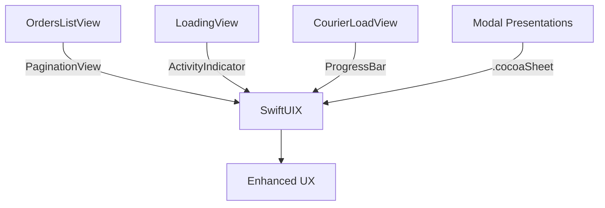

# Ticket: SwiftUIX-03 — Advanced UI Components Integration

Read /Users/sasha/IdeaProjects/ios/zariz/dev/tickets/coding_rules.md first

## 1. Task Summary

**Objective:** Integrate advanced SwiftUIX components to enhance visual feedback, navigation, and user interactions.

**Expected Outcome:** App uses SwiftUIX's ActivityIndicator, ProgressBar, PaginationView, and modal presentations for improved UX.

**Success Criteria:**
- Loading states use SwiftUIX ActivityIndicator
- Order list pagination uses PaginationView
- Progress tracking uses ProgressBar
- Modal presentations use SwiftUIX sheet modifiers
- Smooth animations (60fps)
- No memory leaks

**Go/No-Go Preconditions:**
- SwiftUIX-02 completed
- Existing loading/pagination logic documented
- Performance baseline established

## 2. Assumptions & Scope

**Assumptions:**
- SwiftUIX components perform better than custom implementations
- Components are customizable to match design system
- No conflicts with existing navigation

**In Scope:**
- Replace ProgressView with ActivityIndicator
- Add PaginationView to order list
- Implement ProgressBar for courier load visualization
- Enhance modal presentations

**Out of Scope:**
- Complete navigation refactor
- Custom animations beyond SwiftUIX
- Third-party animation libraries

**Non-Goals:**
- Replacing all standard SwiftUI components
- Adding unnecessary visual effects

**Budgets:**
- Animation frame rate: ≥ 60fps
- Memory overhead: ≤ 20MB additional
- p95 modal presentation: ≤ 200ms

## 3. Architecture Overview

**Components:**
- **LoadingView:** ActivityIndicator for async operations
- **OrdersListView:** PaginationView for infinite scroll
- **CourierLoadView:** ProgressBar for capacity visualization
- **Modal System:** Enhanced sheet presentations

**Pattern:** Decorator pattern for loading states; composition for pagination.

**Diagram:**


**Key Interfaces:**
- `ActivityIndicator`: Customizable loading spinner
- `PaginationView`: Infinite scroll with pull-to-refresh
- `ProgressBar`: Linear/circular progress with labels
- `.cocoaSheet()`: Native-like modal presentation

## 4. Affected Modules/Files

**Files to Modify:**
- `ios/Zariz/Features/Orders/OrdersListView.swift`: Add PaginationView
- `ios/Zariz/Features/Orders/OrderDetailView.swift`: Add ActivityIndicator for actions
- `ios/Zariz/Features/Couriers/CourierRowView.swift`: Add ProgressBar for load
- `ios/Zariz/Modules/DesignSystem/LoadingView.swift`: Replace with ActivityIndicator

**Files to Create:**
- `ios/Zariz/Modules/DesignSystem/ProgressStyles.swift`: Shared progress bar styles
- `ios/Zariz/Modules/DesignSystem/ModalPresentations.swift`: Modal helpers

**Config Files:**
- None

## 5. Implementation Steps

1. **Create Loading View Component**
   ```swift
   // ios/Zariz/Modules/DesignSystem/LoadingView.swift
   import SwiftUI
   import SwiftUIX
   
   struct LoadingView: View {
       let message: String?
       
       var body: some View {
           VStack(spacing: DS.Spacing.md) {
               ActivityIndicator()
                   .style(.large)
                   .color(DS.Color.brandPrimary)
               
               if let message {
                   Text(message)
                       .font(DS.Font.caption)
                       .foregroundStyle(DS.Color.textSecondary)
               }
           }
       }
   }
   ```

2. **Add Pagination to Orders List**
   ```swift
   // ios/Zariz/Features/Orders/OrdersListView.swift
   import SwiftUIX
   
   struct OrdersListView: View {
       @StateObject private var viewModel = OrdersViewModel()
       
       var body: some View {
           PaginationView(
               data: viewModel.orders,
               isLoading: viewModel.isLoading,
               hasMore: viewModel.hasMore
           ) { order in
               OrderRowView(order: order)
           } onLoadMore: {
               await viewModel.loadMore()
           }
           .refreshable {
               await viewModel.refresh()
           }
       }
   }
   ```

3. **Implement Progress Bar for Courier Load**
   ```swift
   // ios/Zariz/Features/Couriers/CourierRowView.swift
   import SwiftUIX
   
   struct CourierLoadView: View {
       let current: Int
       let capacity: Int
       
       var progress: Double {
           Double(current) / Double(capacity)
       }
       
       var body: some View {
           VStack(alignment: .leading, spacing: DS.Spacing.xs) {
               HStack {
                   Text("Current Load")
                       .font(DS.Font.caption)
                   Spacer()
                   Text("\(current)/\(capacity)")
                       .font(DS.Font.caption.weight(.semibold))
               }
               
               ProgressBar(value: progress)
                   .progressBarStyle(.linear)
                   .foregroundColor(loadColor)
                   .frame(height: 8)
           }
       }
       
       var loadColor: Color {
           switch progress {
           case 0..<0.7: return DS.Color.success
           case 0.7..<0.9: return DS.Color.warning
           default: return DS.Color.error
           }
       }
   }
   ```

4. **Enhance Modal Presentations**
   ```swift
   // ios/Zariz/Modules/DesignSystem/ModalPresentations.swift
   import SwiftUI
   import SwiftUIX
   
   extension View {
       func zarizSheet<Content: View>(
           isPresented: Binding<Bool>,
           @ViewBuilder content: @escaping () -> Content
       ) -> some View {
           self.cocoaSheet(isPresented: isPresented) {
               content()
                   .presentationDetents([.medium, .large])
                   .presentationDragIndicator(.visible)
           }
       }
   }
   ```

5. **Add Loading States to Actions**
   ```swift
   // ios/Zariz/Features/Orders/OrderDetailView.swift
   struct OrderDetailView: View {
       @State private var isPerformingAction = false
       
       var body: some View {
           VStack {
               // Content
               
               if isPerformingAction {
                   LoadingView(message: "Processing...")
                       .transition(.opacity)
               }
           }
           .animation(.easeInOut, value: isPerformingAction)
       }
       
       private func performAccept() {
           isPerformingAction = true
           Task {
               defer { isPerformingAction = false }
               try await OrdersService.shared.accept(id: orderId)
           }
       }
   }
   ```

6. **Create Progress Styles**
   ```swift
   // ios/Zariz/Modules/DesignSystem/ProgressStyles.swift
   import SwiftUI
   import SwiftUIX
   
   extension ProgressBar {
       func zarizStyle() -> some View {
           self
               .progressBarStyle(.linear)
               .frame(height: 8)
               .cornerRadius(4)
       }
   }
   ```

## 6. Interfaces & Contracts

**ActivityIndicator API:**
```swift
ActivityIndicator()
    .style(.large | .medium | .small)
    .color(Color)
```

**PaginationView API:**
```swift
PaginationView(
    data: [T],
    isLoading: Bool,
    hasMore: Bool
) { item in
    // Row view
} onLoadMore: {
    // Load next page
}
```

**ProgressBar API:**
```swift
ProgressBar(value: Double) // 0.0 to 1.0
    .progressBarStyle(.linear | .circular)
    .foregroundColor(Color)
```

**Backward Compatibility:** Wraps existing logic; no breaking changes.

## 7. Data Model & Migration

Not applicable (UI only).

## 8. Testing & Validation

**Unit Tests:**
```swift
// ios/ZarizTests/LoadingViewTests.swift
func testActivityIndicatorAppears() {
    let view = LoadingView(message: "Loading...")
    let host = UIHostingController(rootView: view)
    XCTAssertNotNil(host.view)
}

func testProgressCalculation() {
    let view = CourierLoadView(current: 6, capacity: 8)
    XCTAssertEqual(view.progress, 0.75)
    XCTAssertEqual(view.loadColor, DS.Color.warning)
}
```

**Integration Tests:**
```swift
// ios/ZarizTests/PaginationTests.swift
func testPaginationLoadMore() async {
    let vm = OrdersViewModel()
    await vm.loadMore()
    XCTAssertTrue(vm.orders.count > 0)
}
```

**UI Tests:**
```swift
// ios/ZarizUITests/OrdersListTests.swift
func testPullToRefresh() {
    let app = XCUIApplication()
    app.launch()
    
    let list = app.scrollViews.firstMatch
    list.swipeDown()
    
    // Verify loading indicator appears
    XCTAssertTrue(app.activityIndicators.firstMatch.exists)
}

func testInfiniteScroll() {
    let app = XCUIApplication()
    app.launch()
    
    let list = app.scrollViews.firstMatch
    list.swipeUp()
    list.swipeUp()
    
    // Verify more items loaded
    XCTAssertTrue(app.cells.count > 20)
}
```

**Performance Tests:**
```swift
// ios/ZarizTests/PerformanceTests.swift
func testProgressBarPerformance() {
    measure {
        for _ in 0..<100 {
            _ = ProgressBar(value: 0.5)
        }
    }
}
```

**Adversarial:**
- Rapid scroll to trigger multiple load-more calls
- Progress values outside 0-1 range
- Modal presentation during navigation
- Memory pressure scenarios

## 9. Observability & Operations

**Logging:**
```swift
let log = Logger(subsystem: "app.zariz", category: "ui.components")
log.info("PaginationView loaded page: \(page), items: \(count)")
log.debug("ProgressBar rendered: value=\(value), color=\(color)")
```

**Metrics:**
- Pagination load time: p95 ≤ 500ms
- Progress bar render time: ≤ 16ms
- Modal presentation time: p95 ≤ 200ms
- Memory usage: baseline + ≤ 20MB

**Metric Names:**
- `ui_pagination_load_ms`
- `ui_progress_render_ms`
- `ui_modal_present_ms`

**Feature Flags:** None required.

**Rollout Plan:** Gradual rollout via TestFlight; monitor performance metrics.

## 10. Risks & Considerations

| Risk | Impact | Mitigation |
|------|--------|------------|
| Performance degradation | High | Profile with Instruments; optimize |
| Memory leaks in pagination | Medium | Use weak references; test with Leaks |
| Animation jank | Medium | Target 60fps; reduce complexity |
| SwiftUIX bugs | Medium | Test thoroughly; have fallback |

**Security:** No security implications (UI only).

**Privacy:** No PII in progress indicators or loading messages.

**Accessibility:**
- ActivityIndicator has accessibility label
- ProgressBar announces percentage
- Modals support VoiceOver

## 11. Implementation Checklist

- [ ] LoadingView created with ActivityIndicator
- [ ] PaginationView integrated in OrdersListView
- [ ] ProgressBar added to CourierLoadView
- [ ] Modal presentations enhanced with cocoaSheet
- [ ] ProgressStyles.swift created
- [ ] ModalPresentations.swift created
- [ ] All unit tests pass
- [ ] UI tests updated and passing
- [ ] Performance profiled (Instruments)
- [ ] Memory leaks checked (Leaks instrument)
- [ ] Accessibility tested (VoiceOver)
- [ ] 60fps verified on iPhone 12
- [ ] Changes committed
- [ ] TestFlight build deployed
- [ ] Metrics dashboard updated
- [ ] No performance regressions after 48h

---

**Estimated Effort:** 6 hours  
**Priority:** P2 (UX enhancement)  
**Dependencies:** SwiftUIX-02  
**Blocks:** None
