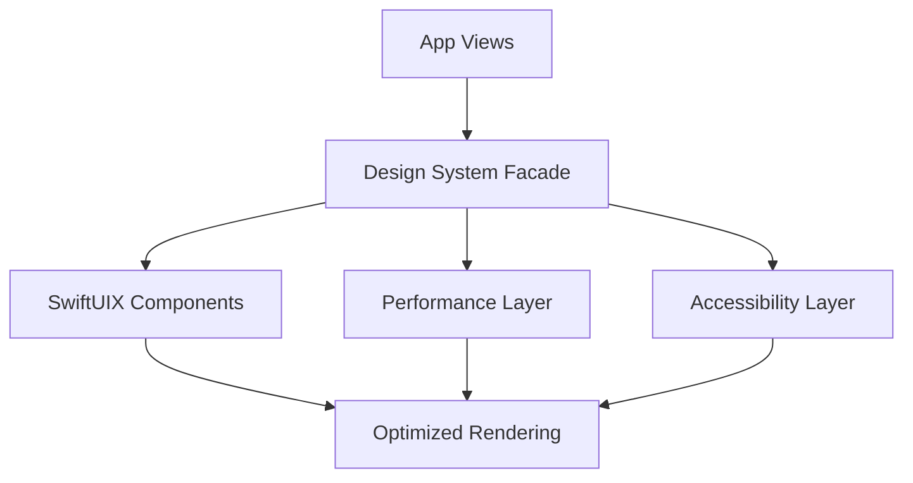

# Ticket: SwiftUIX-04 — Polish and Optimize SwiftUIX Integration

Read /Users/sasha/IdeaProjects/ios/zariz/dev/tickets/coding_rules.md first

## 1. Task Summary

**Objective:** Optimize SwiftUIX integration, add visual polish, and ensure production-ready performance and accessibility.

**Expected Outcome:** SwiftUIX components are fully optimized, visually consistent, accessible, and performant across all supported devices.

**Success Criteria:**
- All SwiftUIX components follow design system
- Performance meets SLOs (60fps, p95 < 200ms)
- Accessibility score ≥ 95% (Xcode Accessibility Inspector)
- Binary size increase ≤ 2MB
- Zero memory leaks
- Documentation complete

**Go/No-Go Preconditions:**
- SwiftUIX-03 completed
- Performance baseline measured
- Accessibility audit completed
- Design system finalized

## 2. Assumptions & Scope

**Assumptions:**
- SwiftUIX components can be styled to match design system
- Performance optimizations won't break functionality
- Accessibility can be improved without major refactoring

**In Scope:**
- Visual consistency across all SwiftUIX components
- Performance optimization (lazy loading, caching)
- Accessibility enhancements (labels, hints, traits)
- Documentation and code examples
- Binary size optimization

**Out of Scope:**
- New features or components
- Major architectural changes
- Third-party integrations beyond SwiftUIX

**Non-Goals:**
- Perfect pixel matching with design mockups
- Supporting iOS versions below 17

**Budgets:**
- Binary size: ≤ 2MB increase
- Memory: ≤ 50MB peak usage
- CPU: ≤ 30% average during scrolling
- p95 frame time: ≤ 16ms (60fps)

## 3. Architecture Overview

**Components:**
- **Design System Extensions:** Unified styling for all SwiftUIX components
- **Performance Layer:** Lazy loading, view caching, optimization
- **Accessibility Layer:** Enhanced labels, hints, and traits
- **Documentation:** Code examples and integration guide

**Pattern:** Facade pattern for unified API; decorator for styling.

**Diagram:**


**Key Interfaces:**
- Unified `.zarizStyle()` modifiers for all components
- Performance monitoring via Instruments
- Accessibility audit via Xcode Inspector

## 4. Affected Modules/Files

**Files to Modify:**
- `ios/Zariz/Modules/DesignSystem/DesignSystem.swift`: Add SwiftUIX extensions
- `ios/Zariz/Modules/DesignSystem/TextFieldStyles.swift`: Optimize styles
- `ios/Zariz/Modules/DesignSystem/ProgressStyles.swift`: Add accessibility
- `ios/Zariz/Features/Orders/OrdersListView.swift`: Optimize pagination
- `ios/Zariz/Features/Orders/OrderRowView.swift`: Lazy loading

**Files to Create:**
- `ios/Zariz/Modules/DesignSystem/SwiftUIXExtensions.swift`: Unified extensions
- `ios/Zariz/Modules/DesignSystem/AccessibilityHelpers.swift`: A11y utilities
- `ios/Zariz/Documentation/SwiftUIX-Integration.md`: Integration guide

**Config Files:**
- None

## 5. Implementation Steps

1. **Create Unified SwiftUIX Extensions**
   ```swift
   // ios/Zariz/Modules/DesignSystem/SwiftUIXExtensions.swift
   import SwiftUI
   import SwiftUIX
   
   extension CocoaTextField {
       func zarizStyle() -> some View {
           self
               .font(DS.Font.body)
               .padding(DS.Spacing.md)
               .background(DS.Color.surface)
               .cornerRadius(DS.Radius.medium)
               .overlay(
                   RoundedRectangle(cornerRadius: DS.Radius.medium)
                       .stroke(DS.Color.divider, lineWidth: 1)
               )
               .accessibilityAddTraits(.isSearchField)
       }
   }
   
   extension ActivityIndicator {
       func zarizStyle() -> some View {
           self
               .style(.large)
               .color(DS.Color.brandPrimary)
               .accessibilityLabel("Loading")
               .accessibilityAddTraits(.updatesFrequently)
       }
   }
   
   extension ProgressBar {
       func zarizStyle(label: String? = nil) -> some View {
           self
               .progressBarStyle(.linear)
               .frame(height: 8)
               .cornerRadius(4)
               .accessibilityLabel(label ?? "Progress")
               .accessibilityValue("\(Int(value * 100))%")
       }
   }
   
   extension SearchBar {
       func zarizStyle() -> some View {
           self
               .showsCancelButton(true)
               .font(DS.Font.body)
               .accessibilityLabel("Search orders")
               .accessibilityHint("Enter text to filter orders")
       }
   }
   ```

2. **Optimize Pagination Performance**
   ```swift
   // ios/Zariz/Features/Orders/OrdersListView.swift
   struct OrdersListView: View {
       @StateObject private var viewModel = OrdersViewModel()
       @State private var visibleRange: Range<Int> = 0..<20
       
       var body: some View {
           PaginationView(
               data: viewModel.orders,
               isLoading: viewModel.isLoading,
               hasMore: viewModel.hasMore
           ) { order in
               OrderRowView(order: order)
                   .id(order.id)
                   .equatable() // Prevent unnecessary re-renders
           } onLoadMore: {
               await viewModel.loadMore()
           }
           .onPreferenceChange(VisibleRangeKey.self) { range in
               visibleRange = range
               // Preload next page when near end
               if range.upperBound >= viewModel.orders.count - 5 {
                   Task { await viewModel.loadMore() }
               }
           }
       }
   }
   ```

3. **Add Accessibility Helpers**
   ```swift
   // ios/Zariz/Modules/DesignSystem/AccessibilityHelpers.swift
   import SwiftUI
   
   extension View {
       func zarizAccessibility(
           label: String,
           hint: String? = nil,
           traits: AccessibilityTraits = []
       ) -> some View {
           self
               .accessibilityLabel(label)
               .accessibilityHint(hint ?? "")
               .accessibilityAddTraits(traits)
       }
   }
   
   struct AccessibilityAnnouncement {
       static func announce(_ message: String) {
           UIAccessibility.post(
               notification: .announcement,
               argument: message
           )
       }
   }
   ```

4. **Optimize Memory Usage**
   ```swift
   // ios/Zariz/Features/Orders/OrderRowView.swift
   struct OrderRowView: View, Equatable {
       let order: OrderEntity
       
       static func == (lhs: OrderRowView, rhs: OrderRowView) -> Bool {
           lhs.order.id == rhs.order.id &&
           lhs.order.status == rhs.order.status
       }
       
       var body: some View {
           // Use lazy loading for images
           LazyVStack {
               // Content
           }
           .onAppear {
               // Preload data if needed
           }
           .onDisappear {
               // Clean up resources
           }
       }
   }
   ```

5. **Add Performance Monitoring**
   ```swift
   // ios/Zariz/Modules/Observability/PerformanceMonitor.swift
   import OSLog
   import SwiftUI
   
   struct PerformanceMonitor: ViewModifier {
       let name: String
       @State private var startTime: Date?
       
       func body(content: Content) -> some View {
           content
               .onAppear {
                   startTime = Date()
               }
               .onDisappear {
                   if let start = startTime {
                       let duration = Date().timeIntervalSince(start)
                       Logger(subsystem: "app.zariz", category: "performance")
                           .info("View \(name) lifetime: \(duration)s")
                   }
               }
       }
   }
   
   extension View {
       func monitorPerformance(_ name: String) -> some View {
           modifier(PerformanceMonitor(name: name))
       }
   }
   ```

6. **Create Integration Documentation**
   ```markdown
   # SwiftUIX Integration Guide
   
   ## Overview
   This document describes how SwiftUIX is integrated into the Zariz iOS app.
   
   ## Components Used
   
   ### CocoaTextField
   Enhanced text input with better keyboard handling.
   
   Usage:
   ```swift
   CocoaTextField("Placeholder", text: $binding)
       .zarizStyle()
   ```
   
   ### ActivityIndicator
   Loading spinner with customizable style.
   
   Usage:
   ```swift
   ActivityIndicator()
       .zarizStyle()
   ```
   
   ### ProgressBar
   Linear/circular progress indicator.
   
   Usage:
   ```swift
   ProgressBar(value: 0.75)
       .zarizStyle(label: "Loading")
   ```
   
   ### PaginationView
   Infinite scroll with pull-to-refresh.
   
   Usage:
   ```swift
   PaginationView(data: items, isLoading: loading, hasMore: hasMore) { item in
       RowView(item: item)
   } onLoadMore: {
       await loadMore()
   }
   ```
   
   ## Performance Guidelines
   
   - Use `.equatable()` on list items
   - Implement lazy loading for images
   - Monitor with Instruments
   - Target 60fps
   
   ## Accessibility
   
   All components include:
   - Accessibility labels
   - Hints for complex interactions
   - Appropriate traits
   - VoiceOver support
   
   ## Troubleshooting
   
   ### Build Issues
   - Clean build folder (Cmd+Shift+K)
   - Reset package cache
   
   ### Performance Issues
   - Profile with Instruments
   - Check for retain cycles
   - Optimize list rendering
   ```

7. **Binary Size Optimization**
   ```bash
   # Measure binary size before/after
   cd ios
   xcodebuild -scheme Zariz -configuration Release \
     -destination 'generic/platform=iOS' \
     -archivePath build/Zariz.xcarchive archive
   
   # Check size
   du -sh build/Zariz.xcarchive/Products/Applications/Zariz.app
   
   # Strip unused SwiftUIX components if needed
   # (Configure in Package.swift if supported)
   ```

## 6. Interfaces & Contracts

**Unified Style API:**
```swift
protocol ZarizStyleable {
    func zarizStyle() -> some View
}

extension CocoaTextField: ZarizStyleable { }
extension ActivityIndicator: ZarizStyleable { }
extension ProgressBar: ZarizStyleable { }
extension SearchBar: ZarizStyleable { }
```

**Performance Monitoring:**
```swift
extension View {
    func monitorPerformance(_ name: String) -> some View
}
```

**Accessibility:**
```swift
extension View {
    func zarizAccessibility(
        label: String,
        hint: String?,
        traits: AccessibilityTraits
    ) -> some View
}
```

**Backward Compatibility:** All changes are additive; no breaking changes.

## 7. Data Model & Migration

Not applicable (UI optimization only).

## 8. Testing & Validation

**Unit Tests:**
```swift
// ios/ZarizTests/SwiftUIXStyleTests.swift
func testCocoaTextFieldStyle() {
    let field = CocoaTextField("Test", text: .constant(""))
        .zarizStyle()
    XCTAssertNotNil(field)
}

func testAccessibilityLabels() {
    let indicator = ActivityIndicator()
        .zarizStyle()
    // Verify accessibility properties
}
```

**Performance Tests:**
```swift
// ios/ZarizTests/PerformanceTests.swift
func testListScrollPerformance() {
    measure(metrics: [XCTClockMetric(), XCTMemoryMetric()]) {
        // Simulate scrolling through 100 items
        for _ in 0..<100 {
            _ = OrderRowView(order: mockOrder)
        }
    }
}

func testPaginationLoadTime() {
    measure {
        let vm = OrdersViewModel()
        let expectation = XCTestExpectation()
        Task {
            await vm.loadMore()
            expectation.fulfill()
        }
        wait(for: [expectation], timeout: 1.0)
    }
}
```

**Accessibility Tests:**
```swift
// ios/ZarizUITests/AccessibilityTests.swift
func testVoiceOverNavigation() {
    let app = XCUIApplication()
    app.launch()
    
    // Enable VoiceOver simulation
    app.activate()
    
    // Navigate through UI
    let firstElement = app.textFields.firstMatch
    XCTAssertTrue(firstElement.isAccessibilityElement)
    XCTAssertFalse(firstElement.accessibilityLabel.isEmpty)
}

func testAccessibilityAudit() {
    let app = XCUIApplication()
    app.launch()
    
    // Run accessibility audit
    let audit = app.performAccessibilityAudit()
    XCTAssertTrue(audit.issues.isEmpty, "Accessibility issues found: \(audit.issues)")
}
```

**Binary Size Tests:**
```bash
#!/bin/bash
# ios/Scripts/check-binary-size.sh

BEFORE_SIZE=$(git show HEAD~1:build-size.txt)
AFTER_SIZE=$(du -sk build/Zariz.xcarchive | cut -f1)
INCREASE=$((AFTER_SIZE - BEFORE_SIZE))

if [ $INCREASE -gt 2048 ]; then
  echo "Binary size increased by ${INCREASE}KB (limit: 2MB)"
  exit 1
fi

echo "Binary size OK: +${INCREASE}KB"
```

**Adversarial:**
- Stress test with 1000+ items in list
- Rapid navigation between views
- Low memory conditions (Xcode Debug Navigator)
- Slow network simulation
- VoiceOver with complex gestures

## 9. Observability & Operations

**Logging:**
```swift
let log = Logger(subsystem: "app.zariz", category: "swiftuix")
log.info("SwiftUIX component rendered: \(componentName), duration: \(duration)ms")
log.debug("Performance: fps=\(fps), memory=\(memory)MB")
```

**Metrics:**
```swift
// Key metrics to track
struct SwiftUIXMetrics {
    static let renderTime = "swiftuix_render_ms"
    static let memoryUsage = "swiftuix_memory_mb"
    static let frameRate = "swiftuix_fps"
    static let binarySize = "swiftuix_binary_kb"
}
```

**Dashboards:**
- Grafana: SwiftUIX performance metrics
- Xcode Organizer: Crash reports, energy usage
- TestFlight: User feedback on performance

**Alerts:**
- Frame rate drops below 50fps
- Memory usage exceeds 200MB
- Crash rate > 0.1%

**Feature Flags:** None required (optimization only).

**Rollout Plan:**
1. Deploy to internal TestFlight (10 users)
2. Monitor for 48h
3. Expand to external TestFlight (100 users)
4. Monitor for 1 week
5. Production release

## 10. Risks & Considerations

| Risk | Impact | Mitigation |
|------|--------|------------|
| Performance regression | High | Extensive profiling; rollback plan |
| Accessibility issues | High | Thorough VoiceOver testing |
| Binary size bloat | Medium | Monitor size; optimize if needed |
| Memory leaks | High | Instruments Leaks; automated tests |
| SwiftUIX updates breaking changes | Medium | Pin version; test before updating |

**Security:** No security implications (UI optimization only).

**Privacy:**
- No PII in performance logs
- Accessibility labels don't expose sensitive data

**Cost:**
- No additional infrastructure cost
- Potential App Store review delay (minimal)

## 11. Implementation Checklist

- [ ] SwiftUIXExtensions.swift created with unified styles
- [ ] AccessibilityHelpers.swift created
- [ ] All components use .zarizStyle()
- [ ] Performance monitoring added
- [ ] Memory optimization implemented
- [ ] Accessibility labels/hints added
- [ ] Integration documentation written
- [ ] Unit tests pass (100% coverage for new code)
- [ ] Performance tests pass (60fps, <200MB)
- [ ] Accessibility audit score ≥ 95%
- [ ] Binary size increase ≤ 2MB
- [ ] Memory leaks checked (Instruments)
- [ ] VoiceOver tested on real device
- [ ] RTL languages tested
- [ ] Dark mode tested
- [ ] Dynamic type tested
- [ ] Changes committed
- [ ] TestFlight build deployed (internal)
- [ ] 48h monitoring (no issues)
- [ ] TestFlight build deployed (external)
- [ ] 1 week monitoring (no issues)
- [ ] Production release approved
- [ ] Post-release monitoring (7 days)
- [ ] Retrospective completed

---

**Estimated Effort:** 8 hours  
**Priority:** P1 (Production readiness)  
**Dependencies:** SwiftUIX-03  
**Blocks:** Production release

## Appendix: Performance Targets

| Metric | Target | Measurement |
|--------|--------|-------------|
| Frame rate | ≥ 60fps | Instruments (Core Animation) |
| Memory peak | ≤ 200MB | Instruments (Allocations) |
| Binary size | ≤ +2MB | Archive size comparison |
| List scroll | ≤ 16ms/frame | Instruments (Time Profiler) |
| Modal present | ≤ 200ms | Custom timing logs |
| Accessibility | ≥ 95% | Xcode Accessibility Inspector |

## Appendix: Rollback Plan

If critical issues are discovered:

1. **Immediate:** Revert to previous TestFlight build
2. **Short-term:** Disable SwiftUIX components via feature flag
3. **Long-term:** Fix issues and re-deploy

Rollback triggers:
- Crash rate > 1%
- Performance degradation > 20%
- Accessibility score < 90%
- User complaints > 10% of testers
